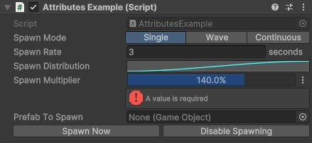
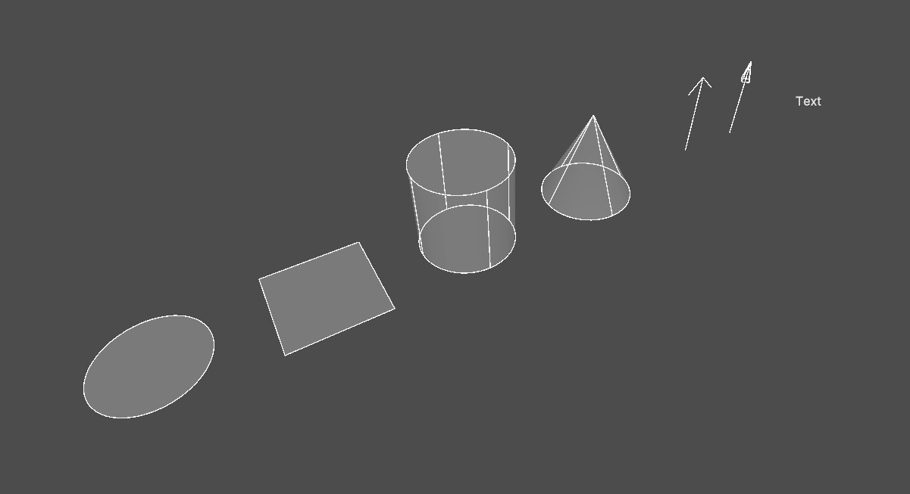

# UnityEssentials

Collection of essential scripts and tools suitable for any type of Unity Project.

## Features

### New Property Attributes

- **ShowIf** - Only shows the property if a given condition is true
- **EnabledIf** - Makes the property editable only if a given condition is true
- **Prefix / Suffix** - Apply prefixes and/or suffixes to value fields
- **Button** - Invoke methods via a button press
- **CharRestriction** - Restrict characters in string
- **CreateAssetButton** - Creates a new asset and assigns it to the assigned property
- **CurveUsage** - Customize AnimationCurve range and color
- **EnumButtons** - Display enum values as horizontal buttons
- **Expand** - Force-expands a property to always show its children
- **HelpBox** - Shows a help box above the property
- **IntPopup** - Select a predetermined range of values via a popup
- **LayerPopup** - Select layers via a popup
- **TagPopup** - Select tags via a popup
- **MaterialPropertyHint**
- **MinMaxRange** - Display a float or int with a min / max slider
- **Monospace** - Draws a text field using a monospace font
- **Polymorphic** - Adds support for polymorphism (?)
- **Prefab** - Forces a GameObject property to only accept prefab assets
- **ProgressBar** - Draws an interactive progress bar
- **ReadOnly** - Shows a property as a read-only field
- **Required** - Shows an error message if no object is assigned or a component is missing
- **Scene** - Shows a scene popup for int (build index) or string (scene name)
- **Separator** - Draws a separator line above the property
- **ShowInInspector** - Apply to C# properties to make them visible with PropertyView structs
- **PropertyView** - Specifies which group of marked C# properties to show when categorized using `ShowInInspector`
- **TexturePreview** - Draws a preview of the assigned texture or sprite below the property

### New Classes and Value Types
- **Nullables** - Serializable nullable values for many common value types
- **Dictionaries** - Serialiable Dictionaries that are compatible with the inspector
- **Collections** - Includes lists that support polymorphism and a component stack for creating a list of sub components
- **Int/Float Range** - Pair of two floats representing a min and max value
- **SceneReference** - Object reference to a scene asset
- **ToggleableFeature** - Subclass with an `enabled` checkbox
- **RepeatTimer** - Helper class for setting up a timer running at a specific (or random) interval
- **PropertyView** - Utility field for displaying C# properties marked with `ShowInInspector`
- **MaterialPropertyName** - Selector for a material property name
- **Axis/AxisDirecton Enums** - Enums representing a specific axis or direction
- **BooleanOperator** - Enum for performing boolean operations (AND/OR/XOR)
- **ComparisonOperator** - Enum representing a comparison operator (such as == or >=)

### Extension Methods
- **Basic Math** - Get the absolute value, sign, or round to a specific number of decimals
- **Colors** - Change alpha, brightness or convert to hex value
- **Vectors** - Promote to other vector types, perform common math or swizzling
- **Matrix4x4** - Extract position, rotation or scale information
- **Rect** - Many helper methods for subdiving or transforming `Rect`s in various ways
- **Texture2D / Mesh** - Get a copy that is read/write enabled
- **Terrains** - Helper methods for getting correct height values or converting coordinates from/to terrain space
- **Exceptions** - Add a custom message to an existing exception

### Extended Update Loop
New event injection points on top of unity's own update loop and ability to run static methods in any update loop using attributes or event subscriptions:
- PreUpdate
- PreLateUpdate
- PostLateUpdate
- PostFixedUpdate

### Mesh Generators
Scripts to simplify procedural mesh generation
- Convex mesh generator (using MIConvexHull)
- Mesh builder (for triangle, line and voxel meshes)
- Primitive mesh generator (for generating custom primitives)
- Topology converter (convert triangle meshes into lines and/or point clouds)

### Coroutine Tools
Helper class for managing coroutines and delayed invocation of functions, including support for static coroutines

### Random Utilities
Miscellaneous new random functions, including weighted distribution functions

#### Debug Utilities
Helper functions to aid in debugging, including temporary gizmos

## Editor Features

### New Menu Items
- **Recompile Scripts** - Forces recompilation of scripts
- **Run Build** - Lists and runs a built executable when placed in the "Builds" directory.

### Transform Inspector Enhancements

- Are optional and can be configured via the project settings
- Can display extra properties such as world position, direction vectors, hierarchy paths, and more
- Toolbar with various controls to apply, reset, copy and paste specific transform properties
- Apply position / rotation / scale on a parent transform using a context menu item
- Can be further extended using multiple provided GUI events

### New Component Context Menu Items
- **Cut Component** - "Copy Component" and "Remove Component" in one command
- **Separate Component** - Separates the selected component into an existing child, a new child object, or parent
- **Search Similar** - Searches for similar components in the hierarchy
- **MonoBehaviour: Replace Script** - Replace the selected MonoBehaviour with a new script
- **Mesh Filter: Export Mesh as Asset** - Extracts the current Mesh as a new asset in the project folder
- **Mesh Renderer: Instantiate Materials** - Creates instances of the renderer's materials to make them unique for this renderer.

### New Script Templates
- New templates for script other than MonoBehaviours
  
### Scene View Tools
- Prefab placement tool
- Distance measurement tool
- Randomize transform tool
- Convex mesh builder
- Reflection probe bounds tool

### New Gizmos

- Draw combined shapes (wireframe and solid gizmos in one)
- Draw colliders
- Draw text labels
- New shapes
  - Circle / Arc
  - Rectangle
  - Cylinder
  - Capsule
  - Cone
  - Arrow / Axes
  - Point / Crosshair
  - Radius Cube / Rectangle
  - Terrain projected shapes

### Property drawer utility
Helper class for working with SerializedProperties

## Installation

> [!WARNING]
> It is highly recommended to target a specific release when installing to avoid breaking changes when unity reinstalls the package. This can be done by appending '#(tag-name)' at the end of the repo URL, such as '#1.0.0'.
> A list of currently available tags can be found [here](https://github.com/D3TONAT0R/UnityPackage-Essentials/tags).

### Option 1: Unity Package Manager

Open the Package Manager window, click on "Add Package from Git URL ...", then enter the following:
```
https://github.com/d3tonat0r/unitypackage-essentials.git#1.0.0-preview-2
```
OR to target the latest commit:
```
https://github.com/d3tonat0r/unitypackage-essentials.git
```

### Option 2: Manually Editing packages.json

Add the following line to your project's `Packages/manifest.json`:

```json
"com.github.d3tonat0r.essentials": "https://github.com/d3tonat0r/unitypackage-essentials.git"
```
